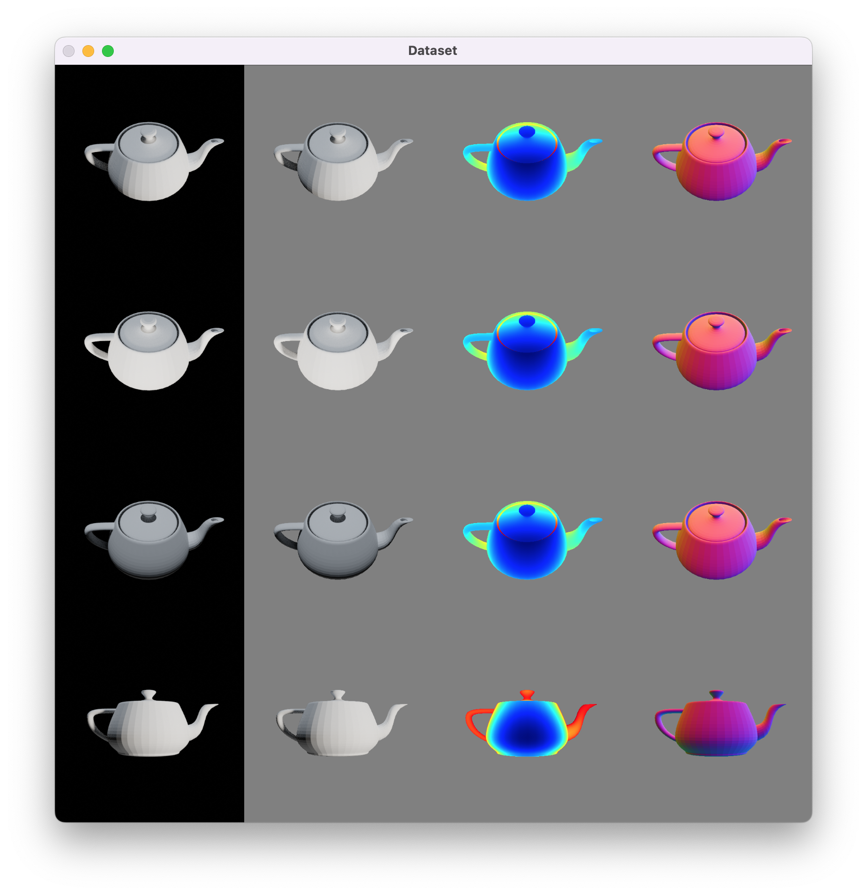

# Generating Synthetic RGB-D Datasets for Texture-less Surfaces Reconstruction

---

[ [Paper*](https://openreview.net/pdf?id=WCVjhq8I2M6) ]
[ [Supplementary](https://openreview.net/attachment?id=WCVjhq8I2M6&name=supplementary_material) ]
[ [Data](https://projects.dfki.uni-kl.de/textureless_object_data/) ]

*The paper is still under review and available at [OpenReview](https://openreview.net/forum?id=WCVjhq8I2M6).

## Requirements

We use the open-source 3D modeling software Blender for dataset generation. If you need to generate more data, install Blender before proceeding to next step.

- `opencv-python>=4.5.4.60`
- `numpy>=1.22.3`
- `torch>=1.11.0`

## Data Generation

1. Install Blender 2.9.3 or higher.

2. Check that the Blender installation is in the PATH and you are able to run `blender` from the command line.

3. Clone this repository.

4. `cd` into the repository directory.

5. `mkdir models` and copy the `*.obj` files for all 3D models that you want to generate data for into the `models` directory.

6. Use the `generate_notex.py` script as follows to generate the data.
```bash
cd src/
blender -b -P generate_notex.py --python-use-system-env -- ../models/ --save_path ../out/ --engine CYCLES --use_gpu
```

Make sure `opencv-python` and `numpy` are installed in your system Python, or install them directly in the Python bundled with Blender.

## Data Visualization

To visualize the generated data, run the following command:

```
python visualize.py -d ../out/ -b 4
```

where `out` is the directory containing data generated in the previous step. This should show you samples of the generated data.



In the `dataloader.py` script, we define a PyTorch dataset to read the generated RGB-D data. This is used by the visualization script to show the data. The dataset class can also be used for the synthetic dataset we [made available with this paper](https://projects.dfki.uni-kl.de/textureless_object_data/).